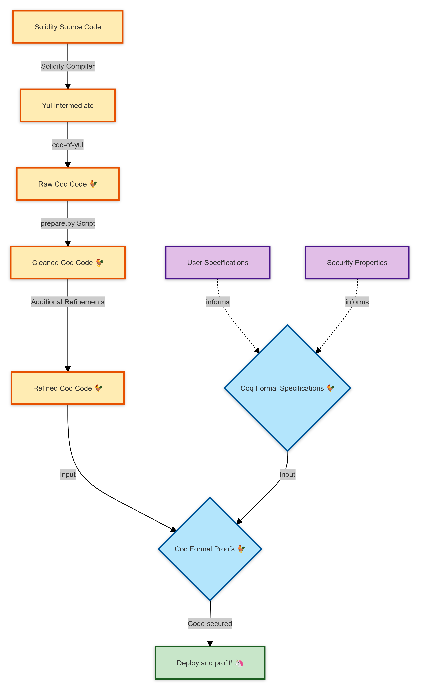

We continue to work on our open source **formal verification** tool for [Solidity](https://soliditylang.org/) named [coq-of-solidity](https://github.com/formal-land/rocq-of-solidity) 🛠️. Formal verification is the strongest form of code audits, as we verify that the code behaves correctly in all possible execution cases 🔍. We use the **interactive theorem prover** [Coq](https://coq.inria.fr/) to express and verify any kinds of properties.

We work by translating the [Yul](https://docs.soliditylang.org/en/latest/yul.html) version of a smart contract to the formal language Coq&nbsp;🐓, in which we then express the code specifications/security properties and formally verify them 🔄. The Yul language is an intermediate language used by the Solidity compiler and others to generate EVM bytecode. Yul is simpler than Solidity and at a higher level than the EVM bytecode, making it a good target for formal verification.

In this blog post we present the recent developments we made to simplify the reasoning 🧠 about Yul programs once translated in Coq.

<!-- truncate -->

:::success AlephZero

_This development is made possible thanks to [AlephZero](https://alephzero.org/). We thank the Aleph Zero Foundation for their support to bring more security to the Web3 space&nbsp;🙏._

:::

<figure>
  
</figure>

## Workflow

We present here the general workflow to use `coq-of-solidity` to make sure your smart contracts contain no bugs 🐛.

<figure>
  
</figure>

The workflow is as follows:

1. We start with a Solidity smart contract.
2. The Solidity compiler translates it to the intermediate language Yul.
3. The `coq-of-yul` tool generates a first Coq version. This version is very low-level, with, for example, variable names represented by the string of their names.
4. The `prepare.py` script makes as many refinements as possible in the Coq code to make it more readable and easier to reason about. For example, we order the functions definitions by the order in which they are used and replace the Yul variables by standard Coq variables.
5. As we are not fully automated yet for the refinements, we add another manual step where we, for example, name the memory locations so that they appear as variables instead of fixed integers.
6. We write in Coq the formal specification of what we expect our smart contract to do or not do. A formal specification is like a test but expressed with quantifiers (∀, ∃) so that we cover all execution cases.
7. We write a formal proof showing that our smart contract indeed validates the formal specification for any user inputs and blockchain states.
8. You can now deploy your smart contract, having followed one of the most secure development methodologies.

## Refinement step

The code that `coq-of-solidity` generates is very verbose. For example, for this Yul function generated by the Solidity compiler to make an addition with overflow check:

```go
function checked_add_uint256(x) -> sum
{
    sum := add(x, /** @src 0:419:421  "20" */ 0x14)
    /// @src 0:33:3484  "contract ERC20 {..."
    if gt(x, sum)
    {
        mstore(0, shl(224, 0x4e487b71))
        mstore(4, 0x11)
        revert(0, 0x24)
    }
}
```
we get a Coq translation:
```coq
Code.Function.make (
  "checked_add_uint256",
  ["x"],
  ["sum"],
  M.scope (
    do! ltac:(M.monadic (
      M.assign (|
        ["sum"],
        Some (M.call (|
          "add",
          [
            M.get_var (| "x" |);
            [Literal.number 0x14]
          ]
        |))
      |)
    )) in
    do! ltac:(M.monadic (
      M.if_ (|
        M.call (|
          "gt",
          [
            M.get_var (| "x" |);
            M.get_var (| "sum" |)
          ]
        |),
        M.scope (
          do! ltac:(M.monadic (
            M.expr_stmt (|
              M.call (|
                "mstore",
                [
                  [Literal.number 0];
                  M.call (|
                    "shl",
                    [
                      [Literal.number 224];
                      [Literal.number 0x4e487b71]
                    ]
                  |)
                ]
              |)
            |)
          )) in
          do! ltac:(M.monadic (
            M.expr_stmt (|
              M.call (|
                "mstore",
                [
                  [Literal.number 4];
                  [Literal.number 0x11]
                ]
              |)
            |)
          )) in
          do! ltac:(M.monadic (
            M.expr_stmt (|
              M.call (|
                "revert",
                [
                  [Literal.number 0];
                  [Literal.number 0x24]
                ]
              |)
            |)
          )) in
          M.pure BlockUnit.Tt
        )
      |)
    )) in
    M.pure BlockUnit.Tt
  )
)
```

This is quite long to follow, and even harder to use to write formal proofs. We made a script [prepare.py](https://github.com/formal-land/rocq-of-solidity/blob/guillaume-claret%40verify-erc20/CoqOfSolidity/test/libsolidity/semanticTests/various/erc20/prepare.py) that simplifies the code above to:
```coq
Definition checked_add_uint256 (x : U256.t) : M.t U256.t :=
  let~ sum := [[ add ~(| x, 0x14 |) ]] in
  do~ [[
    M.if_unit (| gt ~(| x, sum |),
      do~ [[ mstore ~(| 0, (shl ~(| 224, 0x4e487b71 |)) |) ]] in
      do~ [[ mstore ~(| 4, 0x11 |) ]] in
      do~ [[ revert ~(| 0, 0x24 |) ]] in
      M.pure tt
    |)
  ]] in
  M.pure sum.
```
This is much more readable. We have monadic notations to compose all the primitive Yul functions such as `mstore` and `revert`, that may cause side effects such as memory mutation or premature return. The code uses standard Coq variables and functions instead of strings, which simplifies the proofs.

To make sure that this transformation is correct, we also generate a Coq proof file that shows that our transformation is correct and that the original and transformed code from `prepare.py` are equivalent ✔️.

### Next

We can simplify the code even further. For example:

- We know that the functions `add`, `gt`, and `shl` are purely functional, so we could explicit this property in the Coq code. For now they are called as monadic functions with the notation `f ~(| arg1, ..., argn |)` even if they never make side effects.
- The `mstore` function stores values at fixed addresses in the memory, here `0` and `4`. We could remove these memory operations by introducing named variables to hold the results instead.

We hope to be able to automate as many refinements as possible in the future, but for now we have to do some manual work 🔧.

## Manual refinements

We manually refine the code by showing that it returns the same result, for every possible input and initial memory state, as a simplified code written by hand. For the&nbsp;`checked_add_uint256` function above we use:
```coq
Definition simulation_checked_add_uint256 (x y : Z) : Result.t Z :=
  if x + y >=? 2 ^ 256 then
    Result.Revert 0 0x24
  else
    Result.Ok (x + y).
```
Here, all the computations are made with the `Z` type of unbounded integers that are simpler to manipulate for the proofs. We use an&nbsp;`if` statement to explicitly detect the overflows. The revert statement has the same parameters as in the original code, but we do not fill the memory area `0` to `0x24` anymore. The reason is that we ignore what the `revert` returned in our specifications as this is not relevant for now and also simplifies the proofs.

In the code above we do not manipulate the memory anymore. In general, we do the following kinds of refinements:

- Using unbounded integers with explicit overflow checks instead of the fixed-size integers of the EVM.
- Using side effects only when necessary, for example for the `revert` statement.
- Removing memory operations by introducing named variables to hold the results.
- Simplifying the storage accesses by using explicit arrays or maps instead of the`keccak256` hash encoding of the addresses.
- Using explicit names for the entrypoints instead of binary encoding with the `keccak256` function.

For now these transformations are manual and semi-automated, but we hope to automate them as much as possible in the future. By proving that `simulation_checked_add_uint256` behaves as the original `checked_add_uint256` function we are sure that we can reason on the simplified code instead of the original one without losing any information 🔍.

:::success Get started

To audit your smart contracts with the method above contact us at&nbsp;[&nbsp;📧&#099;&#111;&#110;&#116;&#097;&#099;&#116;&#064;formal&#046;&#108;&#097;&#110;&#100;](mailto:contact@formal.land).

Compared to other auditing methods, formal verification has the strong advantage of covering all possible execution cases 💪.

:::

## Conclusion

We have presented the current status of our work to formally verify smart contracts, especially the refinements steps that make the reasoning possible. In our next posts we will continue seeing how we can verify a full smart contract 🔮.
