In this blog post, we present the formal verification effort we started to show the absence of bugs in the [⚈&nbsp;Smoo.th](https://smoo.th/) library, a library for optimized [〰️&nbsp;elliptic curve](https://en.wikipedia.org/wiki/Elliptic_curve) operations in [Solidity](https://soliditylang.org/). We are using our tool [coq-of-solidity](https://github.com/formal-land/rocq-of-solidity) to make this non-trivial verification using the generic proof assistant [🐓&nbsp;Coq](https://coq.inria.fr/).

The **Smoo.th** library is interesting as elliptic curves are at the core of many cryptographic protocols, including authentication protocols, and having a generic and fast implementation simplifies the development of [dApps](https://en.wikipedia.org/wiki/Decentralized_application) in environments with missing pre-compiled (like L1s) or missing circuits (like zero-knowledge layers).

From a verification point of view, it is very challenging as it combines low-level operations (hand-optimized [Yul](https://docs.soliditylang.org/en/latest/yul.html) code with bit shifts, inlined functions, ...) with higher-level reasoning on elliptic curves and arithmetic&nbsp;💪.

<!-- truncate -->

:::success Get started

To ensure your code is secure today, contact us at&nbsp;[&nbsp;💌&#099;&#111;&#110;&#116;&#097;&#099;&#116;&#064;formal&#046;&#108;&#097;&#110;&#100;](mailto:contact@formal.land)!&nbsp;🚀

Formal verification goes further than traditional audits to make 100% sure you cannot lose your funds, thanks to a **mathematical reasoning on the code**. It can be integrated into your CI pipeline to check that every commit is fully correct **without doing a whole audit again**.

We make bugs such as the [DAO hack](https://www.gemini.com/fr-fr/cryptopedia/the-dao-hack-makerdao) ($60 million stolen) virtually **impossible to happen again**.

:::

<figure>
  
</figure>

## 🗺️ Design of the library

The library is implemented in [SCL_mulmuladdX_fullgen_b4.sol](https://github.com/get-smooth/crypto-lib/blob/main/src/elliptic/SCL_mulmuladdX_fullgen_b4.sol) mostly in Yul. Given two points $G$ and $Q$ on an elliptic curve in the field $\mathbb{F}_p$ and two scalars $u$ and $v$, it computes the following operation:

$$
u \cdot G + v \cdot Q
$$

where the points are represented as $(x, y)$ coordinates, the scalars are integers, and the curve is described in the short Weierstrass form.

Here is a diagram to summarize the workflow of the library&nbsp;🤓:

<figure>
  
</figure>

You can find more details about the algorithms used in the library in the complete [audit report](https://github.com/get-smooth/crypto-lib/blob/main/doc/Audits/CRX_smooth_report_2024_07_11_v1.2.pdf) by [CryptoExperts](https://www.cryptoexperts.com/).

Our goal is to show that all these steps are equivalent to doing the naive operation of adding the points $u \cdot G$ and $v \cdot Q$ on the elliptic curve, ignoring a higher gas consumption and that the library is then free of bugs. Note that there are a few exceptional points, for example, when $G$ is the opposite of $Q$, where the library does not work as it is and runs another algorithm instead. We need to make these points explicit in the proof and assume we are not in these special cases.

## 🐓 Translation to Coq

In order to formally verify that the code is correct for any possible inputs, we need to first translate it to a proof language, in our case Coq. We run our tool `coq-of-solidity` on the optimized Yul code as generated by the Solidity compiler, that optimizes further the already hand-optimized code of the library. All our verification work is available on GitHub in the folder [coq/CoqOfSolidity/contracts/scl/mulmuladdX_fullgen_b4](https://github.com/formal-land/rocq-of-solidity/tree/develop/coq/CoqOfSolidity/contracts/scl/mulmuladdX_fullgen_b4) of the [coq-of-solidity's repository](https://github.com/formal-land/rocq-of-solidity).

Here is an example of hand-written Yul code from the contract, to compute the most-significant bit from the scalars:

```go
ZZZ := 0
for {} iszero(ZZZ) { mask := shr(1, mask) } {
  ZZZ := add(
    add(
      sub(1, iszero(and(scalar_u, mask))),
      shl(1, sub(1, iszero(and(shr(128, scalar_u), mask))))
    ),
    add(
      shl(2, sub(1, iszero(and(scalar_v, mask)))),
      shl(3, sub(1, iszero(and(shr(128, scalar_v), mask))))
    )
  )
}
```

The Yul code after optimization by the Solidity compiler is:

```go
mstore(0xe0, 0)
for { } iszero(mload(0xe0)) { mstore(0x01a0, shr(1, mload(0x01a0))) } {
    mstore(0xe0, add(
      add(
        sub(1, iszero(and(mload(0x0120), mload(0x01a0)))),
        shl(1, sub(1, iszero(and(shr(128, mload(0x0120)), mload(0x01a0)))))
      ),
      add(
        shl(2, sub(1, iszero(and(mload(0x0160), mload(0x01a0))))),
        shl(3, sub(1, iszero(and(shr(128, mload(0x0160)), mload(0x01a0)))))
      )
    ))
}
```

As we can see, the variable names were replaced by fixed memory addresses. As we can see, this will make the verification more complex. The Coq code that we generate with `coq-of-solidity` is:

```coq
do~ [[ mstore ~(| 0xe0, 0 |) ]] in
let_state~ 'tt :=
  (* for loop *)
  Shallow.for_
    (* init state *)
    tt
    (* condition *)
    (fun 'tt => [[
      iszero ~(| mload ~(| 0xe0 |) |)
    ]])
    (* body *)
    (fun 'tt =>
      do~ [[
        mstore ~(| 0xe0, add ~(|
          add ~(|
            sub ~(| 1, iszero ~(| and ~(| mload ~(| 0x0120 |), mload ~(| 0x01a0 |) |) |) |),
            shl ~(| 1, sub ~(| 1, iszero ~(| and ~(| shr ~(| 128, mload ~(| 0x0120 |) |), mload ~(| 0x01a0 |) |) |) |) |)
          |),
          add ~(|
            shl ~(| 2, sub ~(| 1, iszero ~(| and ~(| mload ~(| 0x0160 |), mload ~(| 0x01a0 |) |) |) |) |),
            shl ~(| 3, sub ~(| 1, iszero ~(| and ~(| shr ~(| 128, mload ~(| 0x0160 |) |), mload ~(| 0x01a0 |) |) |) |) |)
          |)
        |) |)
      ]] in
      M.pure (BlockUnit.Tt, tt))
    (* post *)
    (fun 'tt =>
      do~ [[ mstore ~(| 0x01a0, shr ~(| 1, mload ~(| 0x01a0 |) |) |) ]] in
      M.pure (BlockUnit.Tt, tt))
default~ tt in
```

We use a monadic notation `f ~(| x1, ..., xn |)` to represent the side-effects of the EVM, such as memory read and write with `mload` and `mstore`. The function `Shallow.for_` represents a for loop with an initial state, a condition, a body, and a post-action. We implement it using a primitive from our monad to represent potentially non-terminating loops.

Here the proper state of the loop is empty (value `tt`) and we instead modify the memory with `mload`. Ideally we should have `(ZZZ, mask)` as the state of the loop to simplify the verification. For our next attempt at verifying this code, we will look at the Yul code generated before optimizations by the Solidity compiler in order to keep these variables.

## 🔬 What we verified

We are not done yet with the verification of this library. For now, we have verified that:

- The addition operation `ecAddn2` is implemented as specified.
- The doubling and negation operation `ecDblNeg` is implemented as in the specification, in an inlined manner.
- The pre-computations of the sums of the possible combinations of points are correct.
- The retrieval of the pre-computed sums from the current bits of the scalars is correct.

For example, here is our statement for the execution of the `ecAddn2` operation:

```coq
Lemma run_usr'dollar'ecAddn2 codes environment state
    (P1_X P1_Y P1_ZZ P1_ZZZ P2_X P2_Y : U256.t) (p : U256.t) :
  let output :=
    ecAddn2 p
      {| PZZ.X := P1_X; PZZ.Y := P1_Y; PZZ.ZZ := P1_ZZ; PZZ.ZZZ := P1_ZZZ |}
      {| PA.X := P2_X; PA.Y := P2_Y |} in
  let output := Result.Ok (output.(PZZ.X), output.(PZZ.Y), output.(PZZ.ZZ), output.(PZZ.ZZZ)) in
  {{? codes, environment, Some state |
    Contract_91.Contract_91_deployed.usr'dollar'ecAddn2 P1_X P1_Y P1_ZZ P1_ZZZ P2_X P2_Y p ⇓
    output
  | Some state ?}}.
```

It says that in a given environment (`codes`, `environment`, `state`), the execution of the translated function `Contract_91.Contract_91_deployed.usr'dollar'ecAddn2` gives the same result as a hand-written purely functional version `ecAddn2` operating on data types directly representing the curve points (`PZZ.t` and `PA.t`).

We verify this execution in a straightforward way by unfolding the definition and executing it step by step:

```coq
Proof.
  simpl.
  unfold Contract_91.Contract_91_deployed.usr'dollar'ecAddn2.
  l. {
    repeat (l; [repeat cu; p|]).
    p.
  }
  p.
Qed.
```

For the verification of the inlined`ecDblNeg` operation, here is the memory state just after computing the coordinates of the doubled point:

```coq
[
  mem0; mem1; Pure.add 0 2048; mem3; mem4;
  Pure.addmod
    (Pure.mulmod
        (Pure.addmod (Pure.mulmod 3 (Pure.mulmod P_127.(PZZ.X) P_127.(PZZ.X) p) p)
          (Pure.mulmod a (Pure.mulmod P_127.(PZZ.ZZ) P_127.(PZZ.ZZ) p) p) p)
        (Pure.addmod (Pure.mulmod 3 (Pure.mulmod P_127.(PZZ.X) P_127.(PZZ.X) p) p)
          (Pure.mulmod a (Pure.mulmod P_127.(PZZ.ZZ) P_127.(PZZ.ZZ) p) p) p) p)
    (Pure.mulmod (Pure.sub p 2)
        (Pure.mulmod P_127.(PZZ.X) (Pure.mulmod (Pure.mulmod 2 P_127.(PZZ.Y) p) (Pure.mulmod 2 P_127.(PZZ.Y) p) p) p) p) p;
  Pure.mulmod P_127.(PZZ.X) (Pure.mulmod (Pure.mulmod 2 P_127.(PZZ.Y) p) (Pure.mulmod 2 P_127.(PZZ.Y) p) p) p;
  Pure.mulmod
    (Pure.mulmod (Pure.mulmod 2 P_127.(PZZ.Y) p) (Pure.mulmod (Pure.mulmod 2 P_127.(PZZ.Y) p) (Pure.mulmod 2 P_127.(PZZ.Y) p) p) p)
    P_127.(PZZ.ZZZ) p;
  Pure.addmod
    (Pure.mulmod
        (Pure.mulmod (Pure.mulmod 2 P_127.(PZZ.Y) p) (Pure.mulmod (Pure.mulmod 2 P_127.(PZZ.Y) p) (Pure.mulmod 2 P_127.(PZZ.Y) p) p) p)
        P_127.(PZZ.Y) p)
    (Pure.mulmod
        (Pure.addmod (Pure.mulmod 3 (Pure.mulmod P_127.(PZZ.X) P_127.(PZZ.X) p) p)
          (Pure.mulmod a (Pure.mulmod P_127.(PZZ.ZZ) P_127.(PZZ.ZZ) p) p) p)
        (Pure.addmod
          (Pure.addmod
              (Pure.mulmod
                (Pure.addmod (Pure.mulmod 3 (Pure.mulmod P_127.(PZZ.X) P_127.(PZZ.X) p) p)
                    (Pure.mulmod a (Pure.mulmod P_127.(PZZ.ZZ) P_127.(PZZ.ZZ) p) p) p)
                (Pure.addmod (Pure.mulmod 3 (Pure.mulmod P_127.(PZZ.X) P_127.(PZZ.X) p) p)
                    (Pure.mulmod a (Pure.mulmod P_127.(PZZ.ZZ) P_127.(PZZ.ZZ) p) p) p) p)
              (Pure.mulmod (Pure.sub p 2)
                (Pure.mulmod P_127.(PZZ.X) (Pure.mulmod (Pure.mulmod 2 P_127.(PZZ.Y) p) (Pure.mulmod 2 P_127.(PZZ.Y) p) p) p) p) p)
          (Pure.sub p (Pure.mulmod P_127.(PZZ.X) (Pure.mulmod (Pure.mulmod 2 P_127.(PZZ.Y) p) (Pure.mulmod 2 P_127.(PZZ.Y) p) p) p))
          p) p) p;
  HighLow.merge u_high u_low; 480; HighLow.merge v_high v_low; Pure.add 0 2048; 2 ^ 126;
  Pure.mulmod (Pure.mulmod (Pure.mulmod 2 P_127.(PZZ.Y) p) (Pure.mulmod 2 P_127.(PZZ.Y) p) p) P_127.(PZZ.ZZ) p;
  p; Q.(PA.Y); Q'.(PA.X); Q'.(PA.Y); p; a; G.(PA.X); G.(PA.Y); G'.(PA.X); G'.(PA.Y);
  0; 0; 0; 0; 0; 0; 0; 0; 0; 0; 0; 0; 0; 0; 0; 0; 0;
  0; 0; 0; 0; 0; 0; 0; 0; 0; 0; 0; 0; 0; 0; 0; 0; 0; 0; 0; 0; 0; 0;
  P0.(PZZ.X); P0.(PZZ.Y); P0.(PZZ.ZZ);  P0.(PZZ.ZZZ);
  P1.(PZZ.X); P1.(PZZ.Y); P1.(PZZ.ZZ); P1.(PZZ.ZZZ);
  P2.(PZZ.X); P2.(PZZ.Y); P2.(PZZ.ZZ); P2.(PZZ.ZZZ);
  P3.(PZZ.X); P3.(PZZ.Y); P3.(PZZ.ZZ); P3.(PZZ.ZZZ);
  P4.(PZZ.X); P4.(PZZ.Y); P4.(PZZ.ZZ); P4.(PZZ.ZZZ);
  P5.(PZZ.X); P5.(PZZ.Y); P5.(PZZ.ZZ); P5.(PZZ.ZZZ);
  P6.(PZZ.X); P6.(PZZ.Y); P6.(PZZ.ZZ); P6.(PZZ.ZZZ);
  P7.(PZZ.X); P7.(PZZ.Y); P7.(PZZ.ZZ); P7.(PZZ.ZZZ);
  P8.(PZZ.X); P8.(PZZ.Y); P8.(PZZ.ZZ); P8.(PZZ.ZZZ);
  P9.(PZZ.X); P9.(PZZ.Y); P9.(PZZ.ZZ); P9.(PZZ.ZZZ);
  P10.(PZZ.X); P10.(PZZ.Y); P10.(PZZ.ZZ); P10.(PZZ.ZZZ);
  P11.(PZZ.X); P11.(PZZ.Y); P11.(PZZ.ZZ); P11.(PZZ.ZZZ);
  P12.(PZZ.X); P12.(PZZ.Y); P12.(PZZ.ZZ); P12.(PZZ.ZZZ);
  P13.(PZZ.X); P13.(PZZ.Y); P13.(PZZ.ZZ); P13.(PZZ.ZZZ);
  P14.(PZZ.X); P14.(PZZ.Y); P14.(PZZ.ZZ); P14.(PZZ.ZZZ);
  P15.(PZZ.X); P15.(PZZ.Y); P15.(PZZ.ZZ); P15.(PZZ.ZZZ);
  0; p
]
```

The state is very large as we are verifying a large function (250 lines) directly mutating the memory. We recognize the parameters of the function (`Q`, `Q'`, `G`, `G'`) as well as the pre-computed points (`P0`, `P1`, `P2`, ..., `P16`). We also see the computation of the coordinates of the doubled point, stored at fixed memory addresses.

We define the `dbl_neg_P_127` point as:

```coq
set (dbl_neg_P_127 := ecDblNeg a p P_127).
```

We then rewrite the memory locations of the doubled point with the coordinates of `dbl_neg_P_127`:

```coq
apply_memory_update_at P_127_X_address dbl_neg_P_127.(PZZ.X); [reflexivity|].
apply_memory_update_at P_127_Y_address dbl_neg_P_127.(PZZ.Y); [reflexivity|].
apply_memory_update_at P_127_ZZ_address dbl_neg_P_127.(PZZ.ZZ); [reflexivity|].
apply_memory_update_at P_127_ZZZ_address dbl_neg_P_127.(PZZ.ZZZ); [reflexivity|].
```

giving us the new state:

```coq
[
  mem0; mem1; Pure.add 0 2048; mem3; mem4; dbl_neg_P_127.(PZZ.X);
  Pure.mulmod P_127.(PZZ.X) (Pure.mulmod (Pure.mulmod 2 P_127.(PZZ.Y) p) (Pure.mulmod 2 P_127.(PZZ.Y) p) p) p;
  dbl_neg_P_127.(PZZ.ZZZ); dbl_neg_P_127.(PZZ.Y);
  HighLow.merge u_high u_low; 480; HighLow.merge v_high v_low; Pure.add 0 2048; 2 ^ 126;
  dbl_neg_P_127.(PZZ.ZZ);
  p; Q.(PA.Y); Q'.(PA.X); Q'.(PA.Y); p; a; G.(PA.X); G.(PA.Y); G'.(PA.X); G'.(PA.Y);
  0; 0; 0; 0; 0; 0; 0; 0; 0; 0; 0; 0; 0; 0; 0; 0; 0;
  0; 0; 0; 0; 0; 0; 0; 0; 0; 0; 0; 0; 0; 0; 0; 0; 0; 0; 0; 0; 0; 0;
  P0.(PZZ.X); P0.(PZZ.Y); P0.(PZZ.ZZ);  P0.(PZZ.ZZZ);
  P1.(PZZ.X); P1.(PZZ.Y); P1.(PZZ.ZZ); P1.(PZZ.ZZZ);
  P2.(PZZ.X); P2.(PZZ.Y); P2.(PZZ.ZZ); P2.(PZZ.ZZZ);
  P3.(PZZ.X); P3.(PZZ.Y); P3.(PZZ.ZZ); P3.(PZZ.ZZZ);
  P4.(PZZ.X); P4.(PZZ.Y); P4.(PZZ.ZZ); P4.(PZZ.ZZZ);
  P5.(PZZ.X); P5.(PZZ.Y); P5.(PZZ.ZZ); P5.(PZZ.ZZZ);
  P6.(PZZ.X); P6.(PZZ.Y); P6.(PZZ.ZZ); P6.(PZZ.ZZZ);
  P7.(PZZ.X); P7.(PZZ.Y); P7.(PZZ.ZZ); P7.(PZZ.ZZZ);
  P8.(PZZ.X); P8.(PZZ.Y); P8.(PZZ.ZZ); P8.(PZZ.ZZZ);
  P9.(PZZ.X); P9.(PZZ.Y); P9.(PZZ.ZZ); P9.(PZZ.ZZZ);
  P10.(PZZ.X); P10.(PZZ.Y); P10.(PZZ.ZZ); P10.(PZZ.ZZZ);
  P11.(PZZ.X); P11.(PZZ.Y); P11.(PZZ.ZZ); P11.(PZZ.ZZZ);
  P12.(PZZ.X); P12.(PZZ.Y); P12.(PZZ.ZZ); P12.(PZZ.ZZZ);
  P13.(PZZ.X); P13.(PZZ.Y); P13.(PZZ.ZZ); P13.(PZZ.ZZZ);
  P14.(PZZ.X); P14.(PZZ.Y); P14.(PZZ.ZZ); P14.(PZZ.ZZZ);
  P15.(PZZ.X); P15.(PZZ.Y); P15.(PZZ.ZZ); P15.(PZZ.ZZZ);
  0; p
]
```

Still large but much cleaner!

## 👀 What remains to be done

There are two main parts that remain to be done in order to have a full formal verification of the library:

1. We need to complete the proof stating that the execution of the smart contract is equivalent to the execution of a purely functional version written in Coq, especially using recursive functions instead of `for` loops. Reasoning on the loops is complex; in the current version, we unroll the loops once in order to have a first step towards the full proof. As the memory used by the main function is quite large, we will first need to change the code we verify by looking at the Yul code generated before optimizations by the Solidity compiler.
2. Show that the purely functional version of the library is equivalent to the plain addition and scalar multiplication. We have only started this work. The main challenge is to show that we can remove the loop by doing the bitwise addition. This will require some bit-arithmetic reasoning, as well as field arithmetic for the operations modulo the prime number $p$.

## ✒️ Conclusion

We have seen how the **Smoo.th** library works at a high level, how we can start verifying it, and what challenges do we face. This is also an interesting example to improve our tool `coq-of-solidity` and develop reasoning primitives for cryptographic code. We will continue this work in the coming weeks to verify more parts of this library.

:::success For more

_Follow us on [X](https://x.com/FormalLand) or [LinkedIn](https://fr.linkedin.com/company/formal-land), or comment on this post below! Feel free to DM us for any formal verification services you need._

:::
