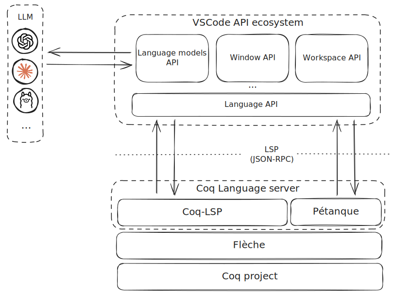
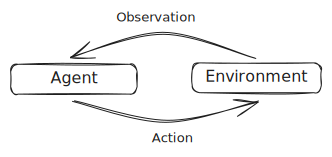

This blog post provides a review of the existing literature on agent-based systems for automated theorem proving, while presenting a general approach to the problem. Additionally, it serves as an informal specification outlining the requirements for a future system we intend to develop.

<!-- truncate -->

:::success Ask for the highest security!

To ensure your code is fully secure today, contact us at&nbsp;[&nbsp;💌&#099;&#111;&#110;&#116;&#097;&#099;&#116;&#064;formal&#046;&#108;&#097;&#110;&#100;](mailto:contact@formal.land)!&nbsp;🚀

We exclusively focus on formal verification to offer you the highest degree of security for your application.

We cover **Rust**, **Solidity**, and **zero-knowledge** projects.

:::

## 🎯 Our goal
We aim to develop an integrated coding assistant for the proof assistant [&nbsp;Rocq/Coq](https://rocq-prover.org/) within [Visual Studio Code](https://code.visualstudio.com/). Despite recent advancements in artificial intelligence, the challenge of creating systems that effectively assist users in writing formal verification code remains unresolved. Our primary focus is on providing support for theorem proving, which we consider the most compelling aspect of the task; other functionalities, such as definition writing, may be explored in future work.

## 🌳 Automated theorem proving as a search in a state space
A coding assistant for a proof assistant can take advantage of a fundamental property that is not possessed by traditional programming languages: it is always possible to deterministically verify whether the code generated for a demonstration is correct (or simply, not incorrect). It only requires the code to be well-typed. More broadly, the assistant can track the progress of the solution.
A proof can be seen as a sequence of tactics, each of which modifies the current goal. Consequently, the proof construction process can be framed as a search through a state space. Using classical terminology for such problems, we can categorize the components of our system as follows:

* **state**: enriched representation of the current goal
* **starting state**: initial goal associated with the theorem (its definition)
* **arrival state**: closed goal
* **actions**: tactics

  <figure>
    
  </figure>

Certain states can be pruned if they do not meet some conditions, such as error states, those where with certainty no progress has been made (e.g., the [copra](https://github.com/trishullab/copra) system proposes a simple symbolic approach to recognize some trivial cases) or if too many attempts have already been made at a certain node.

The set of tactics that can be applied in a given state is potentially infinite. To guide the search, one or more oracles are queried, which provide suggestions on applicable tactics. These oracles can be either LLM-based agents or traditional symbolic procedures (e.g., [CoqHammer](https://coqhammer.github.io/)). Multiple oracles may coexist, offering alternative solutions. Two examples of LLM-based oracles are:

* oracle that produces a list of $k$ possible alternative tactics to be applied at a given goal;
* oracle that produces a complete demonstration for a given goal.

It is not obvious whether a procedure that proceeds in depth or one that proceeds in breadth is preferable. As is often the case with research problems, a "hybrid" approach might be preferable. In any case, one could imagine ordering the frontier on the basis of how promising a certain state is, thereby guiding the search process. The problem of determining whether one state is more promising than another through heuristics (a kind of "distance" from the successful state) is certainly interesting and would merit future study.

One can imagine two procedures, one in breadth and one in depth. From the union of the two, a hybrid solution could be devised.

  <figure>
    
    <figcaption>Depth search</figcaption>
  </figure>

  <figure>
    
    <figcaption>Breadth search by beam search: in this specific case, a heuristic is employed to limit the number of expanded nodes</figcaption>
  </figure>

The system should be flexible enough and allow for the implementation of different versions of the search algorithm that could be refined as the work progresses.

### Learning from errors
By leveraging the ability of an LLM to generate an infinite number of tactics and possibly update the prompt to refine the query, errors can be exploited to generate new tactics. For example, a node (state) might not be closed as soon as it is expanded, but it could be re-expanded in the future, enriched with the knowledge of past errors.

  <figure>
    
  </figure>

## 👨🏻‍💻 Integration with the user
The system must integrate forms of communication and interaction with the user, which guide the user's construction of the proof. In this context, the coding assistant is not envisioned as a fully automated proof tool, but rather as a coding companion that leverages the support of the human developer. For instance, such a companion system does not necessarily need to complete the proof, but could instead generate partial solutions, offering the user multiple incomplete options and allowing them to select the one they deem most appropriate as a starting point.

## 🔧 The technology stack
The system is designed to be distributed as a Visual Studio Code extension. This approach offers several advantages, including access to the editor's extensive ecosystem of APIs, which facilitates seamless integration into standard development workflows and user interactions. Additionally, it simplifies the publishing and installation processes.

  <figure>
    
  </figure>

### Large language models
Models and ad-hoc architectures for theorem proving have been proposed in the literature, including [ReProver](https://github.com/lean-dojo/ReProver) (for [Lean](https://lean-lang.org/)). The cost of maintaining and the complexity of configuring and adapting these systems is generally high. More simply, commercial versions of the most common LLMs (GPTs, , ...) can be used, leveraging prompt-engineering techniques. Several papers demonstrate that comparable results to state-of-the-art models can be achieved using such approaches.

### The VSCode API ecosystem
VSCode offers a rich ecosystem of APIs that can be used to integrate your extension with common development processes, simplify user interaction, and communicate with external tools. In particular, the new [Language Model API](https://code.visualstudio.com/api/extension-guides/language-model) is particularly useful for our purposes. It offers a common interface as well as tools to simplify communication with popular LLMs. Through the use of [Proposed API](https://github.com/microsoft/vscode/blob/main/src/vscode-dts/vscode.proposed.chatProvider.d.ts), it is also possible to integrate local models, which are useful mainly in the testing phase of the first iterations. VSCode's [Language API](https://code.visualstudio.com/api/references/vscode-api#languages) simplifies the development and integration of an LSP client.

### Language server
Language analysis capabilities are provided by the language server [Coq-LSP](https://github.com/ejgallego/rocq-lsp), which has recently been released as part of the [Pétanque](https://github.com/ejgallego/rocq-lsp/tree/main/petanque) project, a lightweight environment for intensive applications targeted at automated theorem-proving projects and especially at agent-based systems. Pétanque operates as a [Gymnasium](https://gymnasium.farama.org/index.html) environment and has already been successfully used in the [NLIR](https://github.com/LLM4Rocq/nlir) system.
At the architectural level, Coq-LSP (and Pétanque) operates as a server towards the coding assistant (the client), providing some functionality in the form of an API via an extended version of the [LSP](https://microsoft.github.io/language-server-protocol/) protocol, including:

* obtaining the current goal for a given theorem,
* obtaining the location of a given theorem's definition,

and many other functionalities commonly accessible through IDEs.

## 🧠 The agent perspective
An alternative description of the system can be accomplished from the agent's perspective. We understand an _agent_ as a software system whose behavior is conditioned by an environment that it can actively alter by performing some actions whose effects condition subsequent observations and, consequently, its future choices.

  <figure>
    
  </figure>

Based on the above definition, we can attempt to classify the components of our system within a classic agent context as follows:

* **Agent**: prompting + large language model + parsing
* **Environment**: user, language server and search algorithm
* **Actions**: tactics
* **Observations**: current goal, examples, definitions, ...

<figure>
  
</figure>

Let us recall that in the proposed general architecture, the agent is only one of the possible types of _oracle_ from which we can obtain useful information to advance the demonstration (albeit the most interesting one), and that multiple _oracles_ at the same time can coexist, e.g., agents implementing different resolution strategies or configurations.

The agent is designed to interact with various components of the environment, for example, by requesting examples, additional information, or simple advice from the user; the current goal; the list of previously attempted and failed tactics for the search algorithm; or semantic data from the language server. The interaction process could be deliberative (guided by the LLM's reasoning) or, more simply, a form of abstraction for a predetermined set of information we intend to request. This interaction with the environment is crucial for defining the goal, enriching the agent's context, and generating input for the prompt. In a recent [blog post](/blog/2025/01/06/annotating-what-we-are-doing), we documented our interest in internally gathering as much information as possible about the recurring human processes of building a demonstration in order to standardize and emulate them within the agent's interaction logic with the environment.

Several propting techniques can be tried. In the [NLIR](https://github.com/LLM4Coq/nlir) system, the prompt is gradually refined through a chain-of-thought approach: first, a natural language response is requested from the LLM, and this response is then used to generate a more precise Rocq code response.

Once the LLM produces an output—whether a tactic, a list of tactics, or a complete proof, depending on the type of agent—the response is parsed and executed within the environment via Pétanque. If an error occurs, the environment is either reverted to its previous state (backtracking), or an error recovery technique is applied (e.g., replacing the problematic code with `admit.`).

## 📊 Evaluation strategies
Benchmarks used for evaluating automated demonstration systems tend to be limited to classical mathematics, focusing on demonstration systems that are _completely automated_ and not of _support_ to demonstration writing.
As a result, these benchmarks can be misleading with regard to the practical utility of such tools in real-world contexts. In addition to traditional evaluation methods, the system should be tested in practical scenarios, such as by applying it to ongoing formal verification projects within [Formal Land](/).

A second critical consideration when evaluating a practical support tool is the cost per request. Integrated LLMs should not be viewed as infinite resources, but rather as constrained resources whose usage must be optimized and minimized, even if that means sacrificing some efficiency.

## 🗂️ Similar projects and resources
The research field in fully autonomous automated theorem using proof assistants is very active and has received a strong boost since the advent of LLMs. The proposed system architecture has been influenced by the following works:
- LeanCopilot ([code](https://github.com/lean-dojo/LeanCopilot), [paper](https://arxiv.org/abs/2404.12534))
- copra ([code](https://github.com/trishullab/copra), [paper](https://arxiv.org/abs/2310.04353))
- CoqPilot ([code](https://github.com/JetBrains-Research/coqpilot), [paper](https://arxiv.org/abs/2410.19605))
- NLIR ([code](https://github.com/LLM4Coq/nlir), [paper](https://openreview.net/forum?id=QzOc0tpdef))

Other interesting resources to further explore this topic:
- 📽️ [Lean Together 2025: Jason Rute, The last mile](https://www.youtube.com/watch?v=Yr8dzfVkeHg)

## 🥡 Key takeaway
* The agent perspective and the search perspective are here complemented in a single system
* The automatic demonstration process can be seen as a sophisticated search in a space of states
* The system must be flexible overall and adapt to different refinements that might be decided in the process
* In a support tool, completeness of proof is not mandatory
* User interaction is crucial
* Evaluation must be carried out in a practical context

:::success For more

_Follow us on [X](https://x.com/FormalLand) or [LinkedIn](https://fr.linkedin.com/company/formal-land) for more, or comment on this post below! Feel free to DM us for any questions or requests!_

:::
