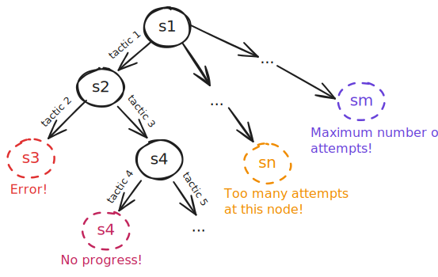
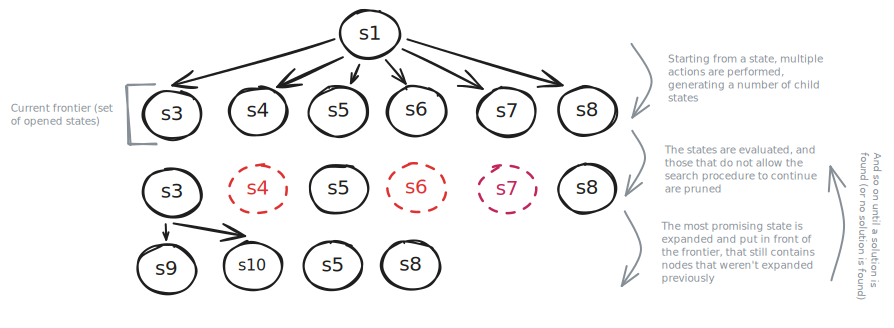
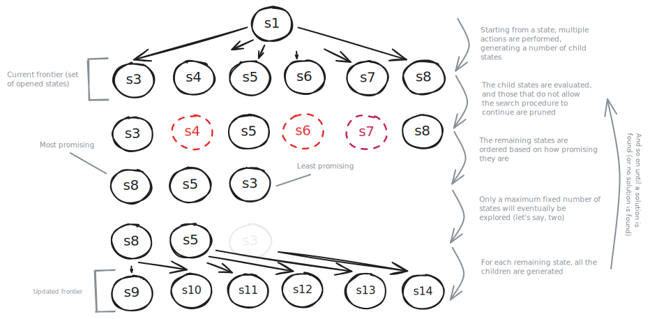
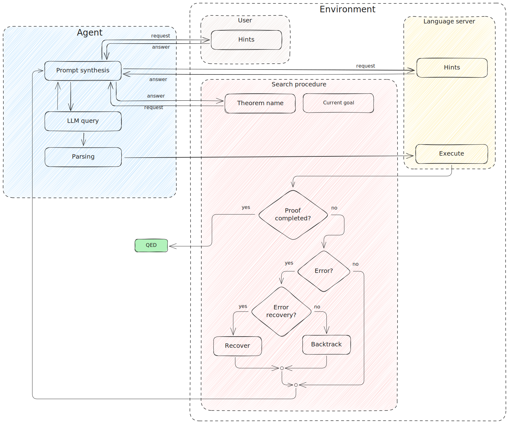

In this blog post we conduct a review of the known literature in the field of agent-based systems for automated theorem proving and propose our own general approach to the problem. At the same time, this post can be intended as an informal specification of the requirements of a future system we plan to implement.

## 🎯 Our goal
We are interested in building an integrated coding assistant in Visual Studio Code for the proof assistant rocq. Despite recent developments in artificial intelligence, the problem of building systems capable of practically helping users write formal verification code remains open. We focus in particularly on providing support for proving theorems, which we believe to be the most interesting; other funcionalities (such as writing definitions), may be discussed in the future.

## 🌳 Automathed theorem proving as a search in a state space
A coding assistant for a proof assistant can take advantage of a fundamental property that is not unique to traditional programming languages: it is always possible to deterministically verify whether the code generated for a demonstration is correct (or simply, not incorrect). It simply requires the code to be well-typed. More generally, it is possible to have access to the progress state of the solution.
A demonstration can be understood as a succession of tactics, each of which produces an effect on the current goal. Therefore, the construction process can be understood as a search in a space of states. Referring to the classical nomenclature for this kind of problem, we can classify the components of our system as follows:

* **state**: enriched representation of the current goal
* **starting state**:initial goal associated with the theorem (its definition)
* **arrival state**:closed goal
* **actions**:tactics

  <figure>
    
  </figure>

Certain states can be pruned if they do not meet some conditions, such as error states, those where with certainty no progress has been made (e.g., the [copra](#️-similar-projects-and-resources) system proposes a simple symbolic approach to recognize some trivial cases) or if too many attempts have already been made at a certain node.

The tactics that can be applied in a given state are possibly infinite. The idea is to guide the search by querying one or more _oracles_, which can provide suggestions on one or more tactics to be applied. Such oracles can be either LLM-based agents or traditional symbolic procedures (e.g., [CoqHammer](https://coqhammer.github.io/)). Multiple oracles can coexist and provide alternative solutions. Two examples of LLM-based oracles are:
* oracle that produces a list of $k$ possible alternative tactics to be applied at a given goal
* oracle that produces a complete demonstration for a given goal

It is not obvious whether a procedure that proceeds in depth or one that proceeds in breadth is preferable. As is often the case with research problems, a “hybrid” approach might be preferable. In any case, one could imagine ordering the frontier on the basis of how promising a certain state is, so as to guide the search.  The problem of determining whether one state is more promising than another through heuristics (a kind of “distance” from the successful state) is certainly interesting and would merit future study.

One can imagine two procedures, one in breadth and one in depth. From the union of the two, a hybrid solution could be devised.

  <figure>
    
    <figcaption>Depth search</figcaption>
  </figure>

  <figure>
    
    <figcaption>Amplitude search by beam search: in this specific case, a heuristic is employed to limit the number of expanded nodes</figcaption>
  </figure>

The system should be flexible enough and allow for the implementation of different versions of the search algorithm that could be refined as the work progresses.

### Learning from errors
By leveraging the ability of an LLM to generate an infinite number of tactics and possibly update the prompt to refine the query, errors can be exploited to generate new tactics. For example, a node (state) might not be closed as soon as it is expanded, but it could be re-expanded in the future enriched with the knowledge of past errors.

  <figure>
    
  </figure>

## 👨🏻‍💻 Integration with the user
The system must integrate forms of communication and interaction with the user, which guide the user's construction of the proof. In this sense, the coding assistant is not conceived of as a fully automated demonstration tool, but as a coding companion, which can draw on the support of the human developer. For example, a companion system does not necessarily have to complete a demonstration, but could construct a part of it, providing several incomplete options to the user and letting him or her choose the one he or she feels is most appropriate as a starting point.

## 🔧 The technology stack
The system is designed to be distributed as an extension for Visual Studio Code. Distributing the application as an extension offers certain advantages, including: the ability to use the editor's rich ecosystem of APIs, simplifying integration into normal development processes and user interaction, and making publishing and installation procedures straightforward.

  <figure>
    
  </figure>

### Large language models
Models and ad-hoc architectures for theorem proving have been proposed in the literature, including [ReProver](https://github.com/lean-dojo/ReProver) (for Lean). The cost of maintaining and the complexity of configuring and adapting these systems is generally high. More simply, commercial versions of the most common LLMs (GPTs, Claude ...) can be used, leveraging prompt-engineering techniques. A number of papers demonstrate how comparable results to state-of-the-art models can be achieved with such approaches.

### The VSCode API ecosystem
VSCode offers a rich ecosystem of APIs that can be used to integrate your extension with common development processes, as well as simplify user interaction and communicate with external tools. In particular, useful for our purposes is the new [Language Model API](https://code.visualstudio.com/api/extension-guides/language-model), which offers a common interface as well as tools to simplify communication with popular LLMs. Through the use of [Proposed API](https://github.com/microsoft/vscode/blob/main/src/vscode-dts/vscode.proposed.chatProvider.d.ts), it is also possible to integrate local models, which are useful mainly in the testing phase of the first iterations. VSCode's [Language API](https://code.visualstudio.com/api/references/vscode-api#languages) simplifies the development and integration of an LSP client.

### Language server
Language analysis capabilities are provided by the language server [Coq-LSP](https://github.com/ejgallego/coq-lsp), which has recently released as part of the [Pétanque](https://github.com/ejgallego/coq-lsp/tree/main/petanque) project, a lightweight environment for intensive applications targeted at automated theorem proving projects and especially agent-based systems. Pétanque operates as a [Gymnasium](https://gymnasium.farama.org/index.html) environment and has already been successfully used in the [NLIR](#️-similar-projects-and-resources) system. 
At the architectural level, Coq-LSP (and Pétanque) operates as a server towards the coding assistant (the client), providing some functionality in the form of an API via an extended version of the [LSP](https://microsoft.github.io/language-server-protocol/) protocol, including:

* obtaining the current goal for a given theorem
* obtaining the location of a given theorem's definition

and many other functionality commonly accessible through IDEs.

## 🧠 The agent perspective
An alternative description of the system can be accomplished from the agent's perspective. We understand an _agent_ as a software system whose behavior is conditioned by an environment that it can actively alter by performing some actions whose effects condition subsequent observations and, consequently, its future choices.

  <figure>
    
  </figure>

Based on the above definition, we can attempt to classify the components of our system within a classic agent context as follows:

* **Agent**: prompting + large language model + parsing
* **Environment**: user, language server and search algorithm
* **Actions**: tactics
* **Observations**: current goal, examples, definitions ...

<figure>
  
</figure>

Let us recall that in the proposed general architecture, the agent is only one of the possible types of _oracle_ from which we can obtain useful information to advance the demonstration ( albeit the most interesting one), and that multiple _oracles_ at the same time can coexist, e.g., agents implementing different resolution strategies or configurations.

The agent is empowered to interact with the various components of the environment, e.g., requesting examples, additional information, or simple advice from the user; the current goal, the list of already tried and failed tactics to the search algorithm; semantic information to the language server. The interaction process could be deliberative (guided by the LLM's intuition) or more simply a form of abstraction for a predetermined set of information we intend to request. Interaction with the environment is critical to defining the goal and enriching the agent's conscence and provides the input for the prompt. In a recent [blog post](https://formal.land/blog/2025/01/06/annotating-what-we-are-doing), we documented our interest in internally gathering as much information as possible about the recurring human processes of building a demonstration in order to standardize and emulate them within the agent's interaction logic with the environment.

Several propting techniques can be tried. In the [NLIR](#️-similar-projects-and-resources) system, the prompt is gradually refined through a chain-of-thought approach, first requesting a natural language response from the LLM, and then using that description to obtain a more accurate response in Coq code.

Once the LLM has output a response (be it a tactic, a list of tactics, or a full proof, depending on the kind of agent implemented), it is parsed and executed in the environment, via Pétanque.
In case of an error, the environment is either restored to its state prior to the execution of the tactician (backtracking), or some kind of error recovery technique is performed (e.g., replacing the lines of code causing the error with `admit.`).

## 📊 Evaluation strategies
Benchmarks used for evaluating automated demonstration systems tend to be limited to classical mathematics, focusing on demonstration systems that are _completely automated_ and not of _support_ to demonstration writing.
In this sense, they can be misleading cira the real usefulness of a tool in practical contexts. In addition to evaluating the system in a “traditional” way, the system must be tested in a real-world context, such as by applying it to the many formal verification projects active in Formal Land.

A second crucial issue when evaluating a practical _support_ tool is the cost per request: integrated LLMs should not be regarded as infinite resources, but as severely limited resources whose use must be minimized, even at the cost of limiting their efficiency.

## 🗂️ Similar projects and resources
The research field in fully autonomous automated theorem using proof assistants is very active and has received a strong boost since the advent of LLMs. The proposed system architecture has been influenced by the following works:
- LeanCopilot ([code](https://github.com/lean-dojo/LeanCopilot), [paper](https://github.com/trishullab/copra))
- copra ([code](https://github.com/trishullab/copra), [paper](https://arxiv.org/abs/2310.04353))
- CoqPilot ([code](https://github.com/JetBrains-Research/coqpilot), [paper](https://arxiv.org/abs/2410.19605))
- NLIR ([code](https://github.com/LLM4Coq/nlir), [paper](https://openreview.net/forum?id=QzOc0tpdef))

Other interesting resources to further explore this topic:
- 📽️ [Lean Together 2025: Jason Rute, The last mile](https://www.youtube.com/watch?v=Yr8dzfVkeHg)

## 🥡 Key takeaway
* The agent perspective and the search perspective are here complemented in a single system
* The automatic demonstration process can be seen as a sophisticated search in a space of states
* The system must be flexible overall and adapt to different refinements that might be decided in the process
* In a support tool, completeness of proof is not mandatory
* User interaction is crucial
* Evaluation must be carried out in a practical context
