In this article we show how we re-build the type and naming information of [🦀&nbsp;Rust](https://www.rust-lang.org/) code in [&nbsp;Rocq/Coq](https://rocq-prover.org/), the formal verification system we use. A challenge is to be able to represent arbitrary Rust programs, including the standard library of Rust and the whole of [Revm](https://github.com/bluealloy/revm), a virtual machine to run [EVM](https://en.wikipedia.org/wiki/Ethereum#Virtual_machine) programs.

<!-- truncate -->

This is the continuation of the following article:

- [🦀 Translation of the Rust's core and alloc crates](/blog/2024/04/26/translation-core-alloc-crates)

:::success Ask for the highest security!

When millions are at stake, bug bounties are not enough. How do you ensure your security audits are exhaustive?

The best way is to use **formal verification**.

**Contact us** at&nbsp;[&nbsp;💌&#099;&#111;&#110;&#116;&#097;&#099;&#116;&#064;formal&#046;&#108;&#097;&#110;&#100;](mailto:contact@formal.land) to make sure your code is safe!&nbsp;🛡️

We cover **Rust**, **Solidity**, and **ZK systems**.

:::

<figure>
  
</figure>

## 🎯 The challenge

Our goal is to be able to formally verify large Rust codebases, counting thousands of lines, and without having to modify the code to make it more amenable to formal verification. Our concrete example is the verification of the Revm that includes about 10,000 lines of Rust code, depending on how far we include the dependencies.

This requires to have a methodology of verification that both:

- Scales with the size of the codebase. Rust programs often use a lot of abstractions, and we make the choice to keep these abstractions in the formal model. Combined with the expressivity of the Rocq prover, we hope this will ensure we can scale our reasoning.
- Supports most of the Rust language, noting that Rust is a complex and feature-rich language.

To make sure our translation from the Rust language to the Rocq system has good support, we generate a translation that is very verbose and rather low-level without interpreting the meaning of the various Rust primitives too much. For example, our translation tool is only about 5,000 lines long. It is written in Rust and uses the APIs of the `rustc` compiler.

This approach leaves the burdens of defining the semantics of Rust and designing the reasoning primitives on the Rocq side.

## 🛝 Strategy

We plan to reason on the translated Rust code with two intermediate steps:

1. **Links** These represent a complete rewriting of the translated code, adding type and naming information that are erased during the translation to Rocq. We also prove that this rewriting is equivalent to the initial translation. We hope to automate this step as much as possible.
2. **Simulations** In this step we make the less obvious transformations, in particular representing the memory mutations in a clean and custom state monad, as well as various optimizations such as collapsing all the integer types if it helps for the proofs later. We also prove that this rewriting is equivalent to the links.

At the end of the **Simulations** step, we should obtain a purely functional and idiomatic representation of the original Rust code in Rocq. This representation should be easier to reason about, and we will be able to formally verify properties of the code.

As a summary, here are the steps we want to follow:

<figure class="text--center">
  
</figure>

## 🧪 Example

Here is an example from the standard library of Rust, which is used to define other comparison operators:

```rust
pub fn max_by<T, F: FnOnce(&T, &T) -> Ordering>(v1: T, v2: T, compare: F) -> T {
    match compare(&v1, &v2) {
        Ordering::Less | Ordering::Equal => v2,
        Ordering::Greater => v1,
    }
}
```

This example is interesting as it uses some abstractions, with polymorphism, traits, closures, and a bit of pointer manipulations. Ideally, we should be able to represent it with a Rocq code of a similar size, without the explicit references&nbsp;`&` that are mostly useless in a purely functional setting. But here is the Rocq code we obtain after running&nbsp;[coq-of-rust](https://github.com/formal-land/coq-of-rust):

```coq
Definition max_by (ε : list Value.t) (τ : list Ty.t) (α : list Value.t) : M :=
  match ε, τ, α with
  | [], [ T; F ], [ v1; v2; compare ] =>
    ltac:(M.monadic
      (let v1 := M.alloc (| v1 |) in
      let v2 := M.alloc (| v2 |) in
      let compare := M.alloc (| compare |) in
      M.read (|
        M.match_operator (|
          M.alloc (|
            M.call_closure (|
              M.get_trait_method (|
                "core::ops::function::FnOnce",
                F,
                [],
                [ Ty.tuple [ Ty.apply (Ty.path "&") [] [ T ]; Ty.apply (Ty.path "&") [] [ T ] ] ],
                "call_once",
                [],
                []
              |),
              [
                M.read (| compare |);
                Value.Tuple
                  [
                    M.borrow (|
                      Pointer.Kind.Ref,
                      M.deref (| M.borrow (| Pointer.Kind.Ref, v1 |) |)
                    |);
                    M.borrow (|
                      Pointer.Kind.Ref,
                      M.deref (| M.borrow (| Pointer.Kind.Ref, v2 |) |)
                    |)
                  ]
              ]
            |)
          |),
          [
            fun γ =>
              ltac:(M.monadic
                (M.find_or_pattern (|
                  γ,
                  [
                    fun γ =>
                      ltac:(M.monadic
                        (let _ := M.is_struct_tuple (| γ, "core::cmp::Ordering::Less" |) in
                        Value.Tuple []));
                    fun γ =>
                      ltac:(M.monadic
                        (let _ := M.is_struct_tuple (| γ, "core::cmp::Ordering::Equal" |) in
                        Value.Tuple []))
                  ],
                  fun γ =>
                    ltac:(M.monadic
                      match γ with
                      | [] => ltac:(M.monadic v2)
                      | _ => M.impossible "wrong number of arguments"
                      end)
                |)));
            fun γ =>
              ltac:(M.monadic
                (let _ := M.is_struct_tuple (| γ, "core::cmp::Ordering::Greater" |) in
                v1))
          ]
        |)
      |)))
  | _, _, _ => M.impossible "wrong number of arguments"
  end.
```

This is extremely verbose and not idiomatic for Rocq! We can see some of the Rust features that are made explicit:

- The list of constant generics `ε`, the list of type generics `τ`, and the list of arguments `α`.
- The memory operations `alloc` and `read`, and the pointers manipulations `borrow` and `deref`.
- The trait instance resolution with `M.get_trait_method`.
- The decomposition of the pattern matching in more elementary operations like `M.is_struct_tuple`.

Most of this information comes from the [THIR intermediate representation](https://rustc-dev-guide.rust-lang.org/thir.html) of the code as provided by the Rust compiler.

Here is the link definition we will write, proven equivalent to the code above by construction:

```coq
Definition run_max_by {T F : Set} `{Link T} `{Link F}
    (Run_FnOnce_for_F :
      function.FnOnce.Run
        F
        (Ref.t Pointer.Kind.Ref T * Ref.t Pointer.Kind.Ref T)
        (Output := Ordering.t)
    )
    (v1 v2 : T) (compare : F) :
  {{ cmp.max_by [] [ Φ T; Φ F ] [ φ v1; φ v2; φ compare ] 🔽 T }}.
Proof.
  destruct Run_FnOnce_for_F as [[call_once [H_call_once run_call_once]]].
  run_symbolic.
  eapply Run.CallPrimitiveGetTraitMethod. {
    apply H_call_once.
  }
  run_symbolic.
  eapply Run.CallClosure. {
    apply (run_call_once compare (Ref.immediate _ v1, Ref.immediate _ v2)).
  }
  intros [ordering |]; cbn; [|run_symbolic].
  destruct ordering; run_symbolic.
Defined.
```

The beginning of the definition corresponds to the trait resolution and calls to the `compare` function. The last part with `destruct ordering` is the representation of the `match` statement in the Rust code. With this definition, we add explicit Rocq types instead of the universal `Value.t` type of the translated code and make explicit the trait resolution. The trait instance has to be provided as an explicit parameter with the `Run_FnOnce_for_F` argument.

With the statement:

```coq
{{ cmp.max_by [] [ Φ T; Φ F ] [ φ v1; φ v2; φ compare ] 🔽 T }}
```

we say that the translated function `cmp.max_by` has a "link" definition, built implicitly in the proof, returning a value of type `T`. We can extract the definition of this function calling the primitive:

```coq
evaluate : forall {Output : Set} `{Link Output} {e : M},
  {{ e 🔽 Output }} ->
  LowM.t (Output.t Output)
```

It returns a "link" computation in the `LowM.t` monad. The output is often unreadable as it is, but we can step through it by symbolic execution. This will be useful for the next step to define and prove equivalent the "simulations".

## 🔮 Link's monad

Like the monad used for the translation of Rust programs by `coq-of-rust`, the link's monad is a free monad but with fewer primitive operations. The primitive operations are only related to the memory handling:

```coq
Inductive t : Set -> Set :=
| StateAlloc {A : Set} `{Link A} (value : A) : t (Ref.Core.t A)
| StateRead {A : Set} `{Link A} (ref_core : Ref.Core.t A) : t A
| StateWrite {A : Set} `{Link A} (ref_core : Ref.Core.t A) (value : A) : t unit
| GetSubPointer {A Sub_A : Set} `{Link A} `{Link Sub_A}
  (ref_core : Ref.Core.t A) (runner : SubPointer.Runner.t A Sub_A) :
  t (Ref.Core.t Sub_A).
```

Compared to the side effects in the generated translation, we eliminate all the operations related to name handling (trait resolution, function calls, etc.). We also always use explicit types instead of the universal `Value.t` type and get rid of the `M.impossible` operation that was necessary to represent impossible branches in the absence of types.

## ✒️ Conclusion

We have presented our general strategy to formally verify large Rust codebases. In the next blog posts, we will go into more details to look at the definition of the proof of equivalence for the links, and at how we automate the most repetitive parts of the proofs.

:::success For more

_Follow us on [X](https://x.com/FormalLand) or [LinkedIn](https://fr.linkedin.com/company/formal-land) for more, or comment on this post below! Feel free to DM us for any questions or requests!_

:::
