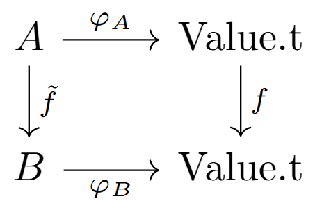

In this blog post we present how represent a proof of execution for translated [🦀&nbsp;Rust](https://www.rust-lang.org/) programs in [&nbsp;Rocq/Coq](https://rocq-prover.org/), to show that it is possible to type the values and resolve the names. Resolving the names amounts to finding the trait instances and an ordering for the function definitions.

We call these proofs of execution "links". They do not contain memory allocation strategies, which can be defined later in a second step called "simulation". From these links we have all the information to extract a typed execution that is equivalent to the translated code from [coq-of-rust](https://github.com/formal-land/coq-of-rust). The core of the work presented in this article is in the file [CoqOfRust/links/M.v](https://github.com/formal-land/coq-of-rust/blob/main/CoqOfRust/links/M.v) on GitHub.

<!-- truncate -->

This is the continuation of the following article:

- [🦀 Typing and naming of Rust code in Rocq (1/3)](/blog/2025/01/30/links-for-rust-in-rocq)

:::success Ask for the highest security!

When millions are at stake, bug bounties are not enough. How do you ensure your security audits are exhaustive?

The best way is to use **formal verification**.

**Contact us** at&nbsp;[&nbsp;💌&#099;&#111;&#110;&#116;&#097;&#099;&#116;&#064;formal&#046;&#108;&#097;&#110;&#100;](mailto:contact@formal.land) to make sure your code is safe!&nbsp;🛡️

We cover **Rust**, **Solidity**, and **ZK systems**.

:::

<figure>
  
</figure>

## 🪨 Untyped code

Representing Rust programs as typed code in Rocq in a systematic way is challenging. Indeed, even if the two systems share many similarities (enum types, polymorphism, traits, ...) there are obstacles that prevent most Rust programs from being well-typed once represented in Rocq:

- There are lifetime annotations in Rust that are not present in Rocq. We can ignore them without too much loss on the typing side.
- The trait/type inference mechanism in Rocq fails in rare cases where it succeeds in Rust. These rare cases are enough to make almost all Rust programs untypable in Rocq. A solution is to add type annotations on all sub-expressions, but this is very verbose and we still encountered some examples where it did not work!
- The type definitions might not be correctly ordered, with mutual dependencies between files or between traits and types. This is probably the biggest issue, as mutually recursive types cannot be defined in Rocq in a general way or can make the reasoning about code too complex when they can.

For all the reasons above, we chose to instead translate the Rust code in Rocq collapsing all the types to a single type `Value.t`:

```coq
Module Value.
  Inductive t : Set :=
  | Bool : bool -> t
  | Integer (kind : IntegerKind.t) (z : Z) : t
  | Float : string -> t
  | UnicodeChar : Z -> t
  | String : string -> t
  | Tuple : list t -> t
  | Array : list t -> t
  | StructRecord : string -> list (string * t) -> t
  | StructTuple : string -> list t -> t
  | Pointer : Pointer.t t -> t
  | Closure : {'(Value, M) : (Set * Set) @ list Value -> M} -> t
  | Error (message : string)
  | DeclaredButUndefined.
End Value.
```

We represent enums and structs using the `StructRecord` or `StructTuple` constructors, depending on when the fields are named or ordered. The first string parameter is the absolute name of the type or the name of the type concatenated to the name of the constructor for enums. Note that in Rust there is always a unique absolute name for all type/value definitions.

For example, if we have the type `Foo` in Rust:

```rust
struct Foo {
    a: i32,
    b: bool,
}
```

we would represent a value:

```rust
let foo = Foo { a: 42, b: true };
```

as:

```coq
Value.StructRecord "Foo" [("a", Value.Integer IntegerKind.I32 42); ("b", Value.Bool true)]
```

In our experience, the named fields always appear in the same order.

## 🗿 Typed version

We let the user define a typed version of the code according to its need. Most of the time, the definitions will be straightforward, following the definitions in Rust. It will still be the opportunity to order the definitions in their order of dependencies, and break some mutual dependencies with custom definitions.

To relate typed values of some type `A` with their representation in `Value.t`, we use a conversion function from `A` to `Value.t` that should ideally be an injection. To help in the proofs and debugging, there should be at most one type and value of this type for each value in `Value.t`. We also add for each type `A` a serialized version of this type in `Ty.t` which may be used on the Rust side to know in a unique way which trait instance to use.

Here is the Rocq type-class we use to represent the conversion:

```coq
Class Link (A : Set) : Set := {
  Φ : Ty.t;
  φ : A -> Value.t;
}.
```

It gives, for a user-defined type `A` in Rocq, a way to represent this type in `Ty.t` on the Rust side, and a way to convert values of this type to `Value.t`. We use the Greek letters `Φ` and `φ` to shorten the definitions. Here is the definition of the `Link` instance for the boolean type:

```coq
Module Bool.
  Global Instance IsLink : Link bool := {
    Φ := Ty.path "bool";
    φ b := Value.Bool b;
  }.
```

Most of the definitions follow the same pattern. Note that we avoid defining a $φ^{-1}$ function that would be impossible or hard to define in general and not needed. In our proofs of equivalence between the untyped translated Rust code and the typed version, we will attempt to show the commutativity of the following diagram:

<figure>
  
</figure>

where:

- $f$ is the function from the translated Rust code,
- $\tilde{f}$ is its typed version that we define,
- $φ_A$ and $φ_B$ are the conversion functions for the types `A` and `B` respectively.

The commutativity of the diagram mean that all the paths are the same, that is to say that:

$$
\forall (x : A),\quad f (φ_A x) = φ_B (\tilde{f} x)
$$

## 🔮 Proof of execution

To both define the typed $\tilde{f}$ version of the Rust code and to prove the commutativity of the diagram, we will define a tree that follows that the tree-like structure of the monad for the translated code.

Here are its basic combinators for the "return" and the "bind" of the monad:

```coq
Inductive t (Output : Set) `{Link Output} : M -> Set :=
| Pure
    (output : Output.t Output)
    (output' : Value.t + Exception.t) :
  output' = Output.to_value output ->
  {{ LowM.Pure output' 🔽 Output }}
| Let {Output' : Set}
    (ty : Ty.t) (to_value : Output' -> Value.t)
    (e : M) (k : Value.t + Exception.t -> M) :
  let _ := Build_Link _ ty to_value in
  {{ e 🔽 Output' }} ->
  (forall (value_inter : Output.t Output'),
    {{ k (Output.to_value value_inter) 🔽 Output }}
  ) ->
  {{ LowM.Let e k 🔽 Output }}
```

It reads as follows:

- **Pure** If we have some `output'` value of type `Value.t` some `output` of type `A` that are related through the `Link` instance, then we can build a tree saying that the monadic untyped term `LowM.pure output'` executes to some value of type `Output` using the conversion from the `Link` instance. We wrap the conversion in the `Output.t` type to also represent exceptions, which are special error values that we propagate, for example, in case of `panic!` or premature `return` in a function.
- **Let** If an expression `e` can be reduced to a value of type `Output'` and if, for any value of type `Output'`, using the same link instance, we can execute `k` of this value to some value of type `Output`, then we can execute the monadic term `LowM.let e k` to some value of type `Output`.

Note that in most of the expressions above the `Link` instance is implicit but still uniquely inferred by Rocq as there is only one for the types `Output` and `Output'` at a time.

## 🎣 Pointers

One difficulty is maintaining the consistency of the `φ` function that we use, especially for pointer operations (allocate, read, and write). Indeed, if one allocates a pointer to a boolean with the function:

$$
\varphi_{\text{bool}} : \text{bool} \to \text{Value.t}\\
\varphi_{\text{bool}}(b) = \text{Value.Bool}(b)
$$

and reads it with the function:

$$
\varphi'_{\text{bool}} : \text{bool} \to \text{Value.t}\\
\varphi'_{\text{bool}}(b) = \text{Value.Bool}(\text{not}(\text{b}))
$$

the value that is read will be different from the value that was allocated.

In order to maintain the consistency of the pointer operations, we attach an extra function $\varphi_A$ to pointers that we allocated in the untyped translation and make sure that this function, acting as a meta-data at the level of the untyped code, is properly forwarded to all subsequent use. That way, we make sure we always use the same $\varphi$ function when allocating, reading, or writing a pointer.

Here is the rule to define a proof of execution for the allocation of a pointer:

```coq
| CallPrimitiveStateAlloc
    (value' : Value.t)
    (k : Value.t -> M)
    (of_value : OfValue.t value') :
  (forall (ref : Ref.t Pointer.Kind.Raw (OfValue.get_Set of_value)),
    {{ k (φ ref) 🔽 Output }}
  ) ->
  {{ LowM.CallPrimitive (Primitive.StateAlloc value') k 🔽 Output }}
```

We have the `Ref.t` type on the side of the typed version to represent the Rust pointers. We reason for any possible references that could be allocated for the untyped value `value'`. We use the `OfValue.t` type to represent a combination of a type&nbsp;$A$ and a certain function&nbsp;$\varphi_A$ with the property that:

$$
\exists (x : A),\quad \varphi_A(x) = \text{value'}
$$

For more details, you can look at the file [CoqOfRust/links/M.v](https://github.com/formal-land/coq-of-rust/blob/main/CoqOfRust/links/M.v).

## 💧 Extracting an execution

The Rocq relation above:

```coq
{{ e 🔽 Output }}
```

is defined in `Set` instead of `Prop`. This means that it contains data in addition to stating the property that there exists an execution of with a certain type. We can then define a Rocq function `evaluate` that is total and builds this execution. Here is its signature:

```coq
Fixpoint evaluate {Output : Set} `{Link Output} {e : M}
    (run : {{ e 🔽 Output }}) :
  LowM.t (Output.t Output).
```

Here `LowM.t` is the type version of the untyped `LowM.t` monad from above. We define this function by induction on the proof of execution `run`. We write this definition using the proof mode of Rocq as it is more convenient for this definition. Here is, for example, the definition for the allocation case (better read using the interactive mode of Rocq):

```coq
{ (* Alloc *)
  apply (LowM.CallPrimitive (Primitive.StateAlloc (OfValue.get_value of_value))).
  intros ref_core.
  eapply evaluate. (* here is the recursive call *)
  match goal with
  | H : forall _, _ |- _ => apply (H {| Ref.core := ref_core |})
  end.
}
```

Having access to the typed execution will be useful for the next phase, in which we will define the memory allocation strategies.

With the method we use, we do not need to define the execution explicitly: we derive it automatically from its equivalence proof with the untyped code, thus saving us time. In addition, as proofs can be generated semi-automatically in Rocq, we also hope to automate a lot of our definitions and have more robust scripts for when the source code changes.

## ✒️ Conclusion

We have seen how to define a proof of execution using equivalent typed values for the untyped translated code from `coq-of-rust`, and extract a runnable typed code from it. In the next article we will see how to do the same for the resolution of names: to find the trait instances and the order of the function definitions.

:::success For more

_Follow us on [X](https://x.com/FormalLand) or [LinkedIn](https://fr.linkedin.com/company/formal-land) for more, or comment on this post below! Feel free to DM us for any questions or requests!_

:::
