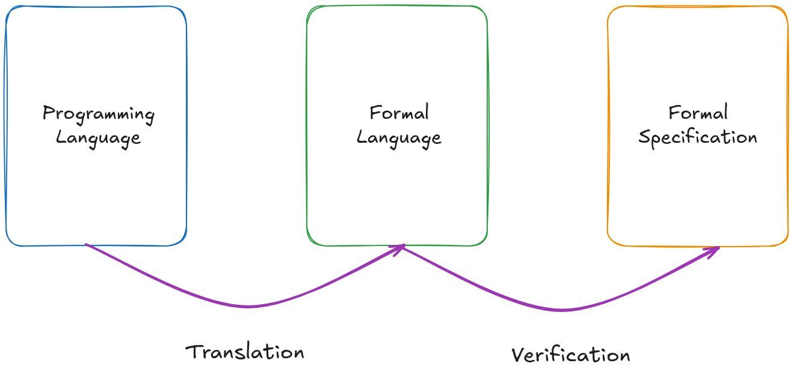

In this post, we propose a general overview of what formal verification is by decomposing it into two main steps:

- **Translation** of the source code to a formal language;
- **Verification** of the formal specification in the formal language.

We will cover the main techniques used at each step, knowing that in most cases it is possible to combine the approaches.

<!-- truncate -->

<figure>
  
</figure>

## Translation

The translation part handles all the programming details, such as manipulating data structures from the standard library, or handling how pointers, states, and i/o are done.

The end goal of the translation is to generate a purely functional representation of the code, as formal systems are purely mathematical representations of the code (think languages like [Haskell](https://www.haskell.org/)/[OCaml](https://ocaml.org/), or mathematical propositions). The end result can be extremely verbose.

There are a few approaches to make it manageable:

1. Use fully automated formal verification, where the computer will have to read the translation, but not the human. This is the approach of SMT/model checking. The downside is that verification can timeout.
2. Use a manual/AI translation to an idiomatic representation in the formal language, with a manual review or tests to make sure it captures all the details. The drawback is that it can introduce mistakes, and it is hard to maintain when code changes.
3. Use a compiler, which can work very well with enough automation or by restricting the source programming language to a specific and "safe" subset. It can be combined with proof-by-refinements, so the user can provide and prove correct custom "cleaning" of the translation.

## Verification

Then comes the time of specifications and proofs.

The specification language can be the programming language itself, with some "assert", some specific language embedded as comments, or the formal language itself. Depending on the language you use, you will have different expressiveness. With more expressive languages, you can write more general properties like "this program never lets non-admins read admin data", leading to cleaner and hence potentially safer specifications. Theorem provers ([Rocq](https://rocq-prover.org/), [Lean](https://leanprover.github.io/), [Isabelle](https://isabelle.in.tum.de/)) are the most expressive.

For the proof, the system either handles it automatically (SMT/model checking), at the cost of loop approximations sometimes, or timeouts when it is too complicated. Or you can help the system manually (theorem prover). It gives more control and removes the "magic" part of the system. It enables the verification of the most complex properties like cryptographic maths. The drawback is that you need to learn and use those languages.

At the end, you are 100% sure your code is correct for what you stated: you get a mathematical proof covering all possible entries. The correctness of what you state is up to the scope you consider (the more you verify, the better!) and the exhaustiveness of your specifications.

<figure>
  
</figure>

## Conclusion

Formal verification is often the combination of the two phases above, with quite different focuses but often similar complexity.

We hope this helps you get a better understanding of what formal methods are and which techniques are best suited to your project.

Do you want to improve your processes by verifying your code? Discuss with us to know what is possible at [&#099;&#111;&#110;&#116;&#097;&#099;&#116;&#064;formal&#046;&#108;&#097;&#110;&#100;](mailto:contact@formal.land).

:::success Socials

Do not forget to follow us on [X](https://x.com/FormalLand) and [LinkedIn](https://fr.linkedin.com/company/formal-land) for more.

:::
