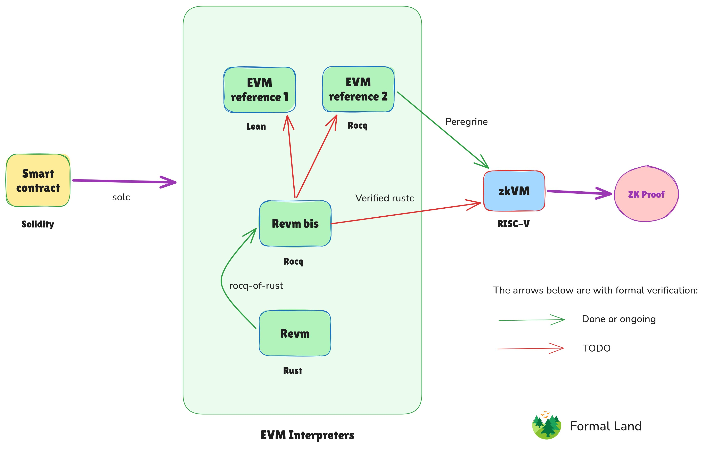

Here is our proposal to make end-to-end formally verified zkEVMs for the next version of Ethereum, with an estimated gain of between 2x and 4x more TPS compared to existing approaches.

<!-- truncate -->

<figure>
  
</figure>

## 🏁 Gain

Between 2x and 4x more TPS (more about it at the end of the article), unlocking a large utility increase.

## 🔒 Why?

End-to-end formal verification is needed as security issues in ZK proofs are hard to track and can be catastrophic given the value at stake, ofseveral billion dollars on the Ethereum mainnet.

## 🎯 Scope

An EVM implementation, like [Revm](https://github.com/bluealloy/revm) or [ethrex](https://github.com/lambdaclass/ethrex), with a correctness proof down to its RISC-V compiled assembly code.

We do not cover the formal verification of the circuits or ZK cryptographic primitives here.

## 🧱 What exists

For now, there is a [verified translation](/blog/2026/02/23/revm-formal-specification-report) from the core of the Revm implementation to the formal language [Rocq](https://rocq-prover.org/) through [rocq-of-rust](https://github.com/formal-land/rocq-of-rust) (our work), and a compilation pipeline, [Peregrine](https://peregrine-project.github.io/), built on top of [CompCert](https://compcert.org/), to compile an EVM interpreter in Rocq to RISC-V in a formally verified way. These projects are either done or in active progress.

## ⚠️ Limitations

The main limitations of relying on an EVM written in Rocq (or any formal language) are:

- **Speed.** It is hard to beat an imperative language like Rust with a mature optimizing toolchain like LLVM.
- **Diversity.** Leveraging existing EVM interpreters brings battle-tested solutions and enhances security through implementation diversity.

## 💡 Proposition

Making a pipeline to compile (a subset of) Rust programs down to assembly code.

This is a huge project. We also need to be able to reason on the semantics of the Rust code that we compile to show it is equivalent to other EVM implementations, something that `rocq-of-rust` already partly provides.

There are ingredients to make this project manageable, such as:

- Relying on AI. This is not a silver bullet, but this technology was not available for previous verified compilation projects.
- Making a certifying compiler rather than a certified compiler. The difference is that we would generate a proof that a given program is correctly compiled, rather than verify the compiler in the general case. This helps to avoid tedious corner cases that rarely appear in most source code.
- Using a simpler Rust backend than LLVM to start with, such as CompCert.

## 📊 Computing the gains

We estimate that, compared to an idiomatic EVM implementation in a formal language (Rocq or Lean), switching to a language with explicit memory management, such as Rust, should yield a **2x performance improvement**.

Going all the way with LLVM verification, we get an additional **2x** compared to using optimization in the formally verified C compiler CompCert.

So, there is between **2x and 4x** improvement based on these estimates.

There is also a project of writing [an EVM interpreter directly in RISC-V assembly](https://github.com/zksecurity/evm-asm), using Lean as a macro language for RISC-V. This project is at an early stage, so we do not know yet about its expected performance and how scalable this approach is.

We assume for this analysis that one needs to run at least one zkVM that is formally verified end-to-end to validate each block.

> Thanks for reading through. Happy to discuss or collaborate on this project! 🚀

:::success Socials

_Follow us on [X](https://x.com/FormalLand) or [LinkedIn](https://fr.linkedin.com/company/formal-land) for more 🫶._

:::
