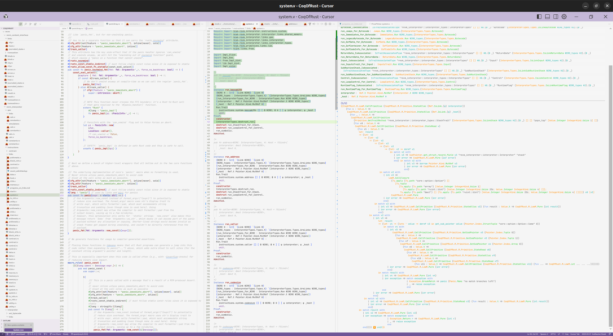

# Install Rocq

There are various options to install the Rocq system according to your preferences. The official page [Rocq/Install](https://rocq-prover.org/install) gives a list of options. Here we give our preferences.

<figure>
  
  <!-- <figcaption>Jeju&nbsp;🐻‍❄️ in the forest.</figcaption> -->
</figure>

## Operating system

In general, it is better to use either Linux or MacOS, as Windows is not well supported with OCaml, the programming language in which Rocq is written. However, the status of OCaml on Windows has improved a lot in the last few years so it might be an option.

## Install Rocq

We recommend the use of the [opam](https://opam.ocaml.org/) package manager to install Rocq, as it will also allows to install the dependencies you need for your developments. This is originally the package manager of OCaml and it got extended for Rocq with an additional repository.

Once you have a working installation of OCaml with `opam`, you can add the Rocq repository with the following command:

```bash
opam repo add rocq-released https://rocq-prover.org/opam/released
```

You can then install Rocq with:

```bash
opam install rocq-prover
```

:::tip

The `opam pin` command forces a package to be in a specific version. It can be useful to keep the same version of Rocq when installing new packages.

With `opam switch` you can create new environments with different versions of Rocq and packages for each of your projects.

:::

## Text editor

We are using [Cursor](https://www.cursor.com/) as our text editor. This is a fork of [VSCode](https://code.visualstudio.com/) with extended AI autocomplete features. This is crucial to save time as formal verification is a time-consuming activity.

There are various plugins to integrate Rocq in Cursor/VScode:

- [vscoq-legacy](https://github.com/rocq-community/vscoq-legacy/) The one we currently use, as this is the most stable for us.
- [coq-lsp](https://github.com/ejgallego/coq-lsp)
- [vscoq](https://github.com/rocq-prover/vscoq)

Here is what it looks like:

<figure>
  
  <!-- <figcaption>Jeju&nbsp;🐻‍❄️ in the forest.</figcaption> -->
</figure>

We recommend having the maximum screen resolution (and/or minimizing the font size) to have a good experience and display as many informations as possible. In green we see the Rocq code that has already been verified. On the right this is the proof view, with the hypothesis on top and the goal below. For any property to prove, the goal is to reduce the goal to something trivial, using the hypothesis and previous lemmas.

> J. 🐾
>
>Follow my [X account](https://x.com/JejuFormalLand) for more learning!
