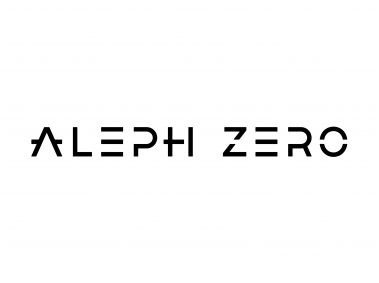

# Introduction

The [Aleph Zero](https://alephzero.org/) blockchain gave us a huge opportunity to develop formal verification tools for the [Rust](https://www.rust-lang.org/) and [Solidity](https://soliditylang.org/) languages, to whom we are very thankful!&nbsp;🙏

Here are the two resulting tools, which are open-source and available for anyone knowledgeable in the formal system [🐓&nbsp;Coq](https://coq.inria.fr/):

- [🦀 coq-of-rust](https://github.com/formal-land/coq-of-rust)
- [🪨 coq-of-solidity](https://github.com/formal-land/rocq-of-solidity)

In both cases we translate the source language to a shallow embedding in Coq, with an output optimized to:

- express specifications and verify them,
- cover a large part of the source language.

In the case of Rust, we translate the code from the THIR intermediate representation, and can translate the code of the standard library of Rust (`alloc` and `core`, see this blog post [🦀&nbsp;Translation of the Rust's core and alloc crates](https://formal.land/blog/2024/04/26/translation-core-alloc-crates)).

The goal is to provide a way to formally verify smart contracts on the Aleph Zero blockchain, which can be written either in Rust or now in Solidity. This is the strongest way to ensure that the code is correct and secure, as the verification is a mathematical proof checked by a computer expressing that the smart contract is secure for all possible inputs.

  

